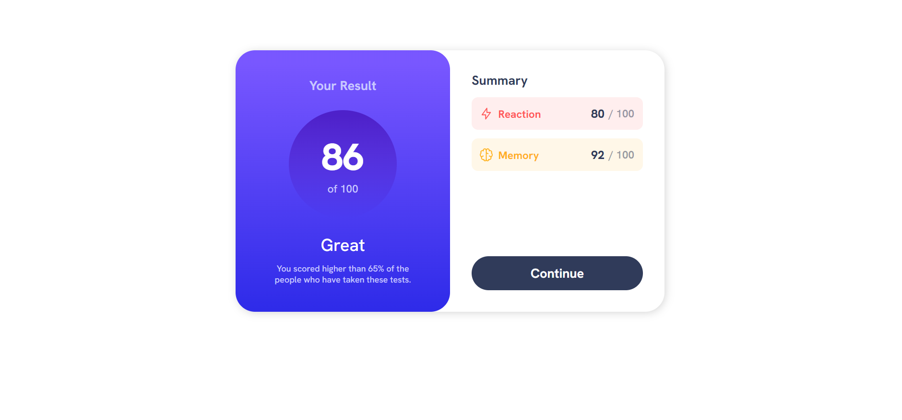

# Result summary component with Handlebars.js and SCSS

Dynamic result summary component with:

- JS
- Handlebars.js
- SCSS

This is my third try of using Handlebars.js, 5th try of SCSS.

My SCSS is still messed up btw, suggestions about my scss are very welcome!! 🙏